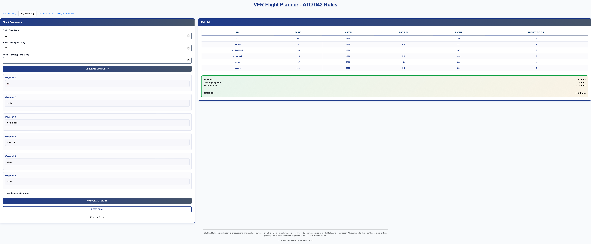
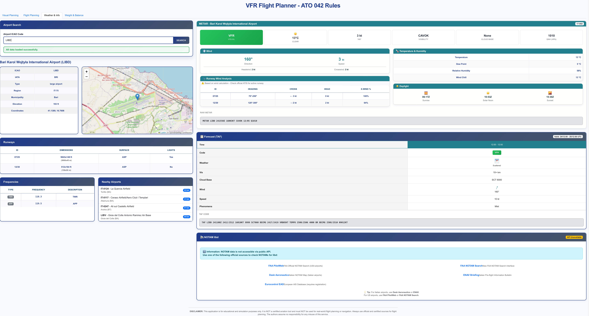

# VFR Flight Planner

A web-based flight planning tool designed for Visual Flight Rules (VFR) operations. While primarily developed with the Italian airspace in mind, the application works globally and provides pilots with the essential tools needed to plan, calculate, and document their flights.

---

## Table of Contents

- [Overview](#overview)
- [Features](#features)
  - [Flight Planning Tab](#flight-planning-tab)
  - [Visual Planning Tab](#visual-planning-tab)
  - [Weight & Balance Tab](#weight--balance-tab)
  - [Weather & Info Tab](#weather--info-tab)
- [Data Sources](#data-sources)
- [Strengths](#strengths)
- [Known Limitations](#known-limitations)
- [Roadmap](#roadmap)
- [Disclaimer](#disclaimer)
- [Contributing](#contributing)
- [License](#license)

---

## Overview

This tool was born out of a practical need: having a single, accessible place to plan VFR flights without juggling multiple websites, apps, and paper charts. It combines flight calculations, visual route planning on aeronautical maps, weight and balance computations, and weather briefings into one coherent interface.

The application runs entirely in the browser and can be deployed on platforms like Vercel with minimal configuration. It uses public APIs and open data sources to provide real-time information wherever possible.

---

## Features

### Flight Planning Tab

The core of the application. Here you can plan your route by entering waypoints (airports, VORs, cities, or coordinates) and the system will calculate:

- **Distance** between each waypoint in nautical miles
- **Magnetic heading** for each leg
- **Estimated flight time** based on your cruising speed
- **Fuel required** including trip fuel, contingency (10%), and reserve (45 minutes)
- **Radial** from each waypoint back to the departure point

**Alternate route support**: You can also plan an alternate route from your destination to a diversion airport, with separate fuel calculations.

**Export options**: Generate an Excel spreadsheet and a formatted PDF document containing your complete flight plan, ready to be printed or filed.

Example workflow:
1. Set your aircraft speed (e.g., 90 knots) and fuel consumption (e.g., 30 liters/hour)
2. Enter waypoints: `LIBD → Matera → Potenza → LIRN`
3. Click Calculate
4. Review the table with headings, distances, and times
5. Export to Excel/PDF for your kneeboard

---

### Visual Planning Tab

An interactive map-based planning interface that displays VFR aeronautical charts overlaid on a standard map. This tab allows you to:

- **Click directly on the map** to add waypoints
- **See the aeronautical overlay** (airspaces, airports, navaids) from OpenAIP
- **Visualize your route** with lines connecting waypoints and 2 NM radius circles around each point
- **View real-time distances and headings** in the sidebar
- **Calculate the full flight plan** with fuel data, just like in the text-based tab
- **Plan alternate routes** using a toggle button to switch between main and alternate route editing

The map uses OpenStreetMap as the base layer and OpenAIP for the aeronautical information overlay. You can drag waypoints to adjust the route, rename them, or delete them as needed.

---

### Weight & Balance Tab

A dedicated section for computing aircraft weight and balance. The application comes pre-configured with several common training aircraft (C172, PA28, P68B), but you can also use custom mode to enter your own envelope and arm values.

Features:
- Input weights for pilot, passengers, baggage, and fuel
- Automatic moment calculation
- Visual representation of the CG envelope
- Clear indication of whether the loading is within limits

The system displays the computed center of gravity on a graph against the aircraft's certified envelope, making it immediately obvious if the configuration is safe for flight.

---

### Weather & Info Tab

A quick briefing tool that fetches current conditions for any airport worldwide:

- **METAR**: Current weather observation with parsed data (wind, visibility, clouds, temperature, QNH)
- **TAF**: Terminal forecast with segment breakdown
- **Airport Information**: Runways, frequencies, coordinates, elevation
- **Nearby Airports**: List of airports within 50 km

Weather data comes from the Aviation Weather Center (aviationweather.gov). Airport information is sourced from OpenAIP (primary) with OurAirports as a fallback.

The interface provides a clean card-based layout showing flight category (VFR, MVFR, IFR, LIFR), wind components, and a runway wind analysis table that calculates headwind and crosswind for each runway based on current conditions.

---

## Data Sources

| Data Type | Primary Source | Fallback |
|-----------|---------------|----------|
| Aeronautical Map Overlay | OpenAIP | - |
| Airport Info (Runways, Frequencies) | OpenAIP API | OurAirports |
| METAR / TAF | Aviation Weather Center | CORS proxy |
| Geocoding (Waypoint Search) | Nominatim / OpenAIP | - |
| Elevation Data | Open Elevation API | - |

---

## Strengths

**Unified interface**: Everything you need for VFR flight planning in one place. No need to switch between multiple websites.

**Visual route planning**: The interactive map with aeronautical overlay makes it easy to visualize your route in relation to airspaces and terrain.

**Works offline (partially)**: Once the airport database is cached locally, basic airport lookups work without an internet connection.

**Export functionality**: Practical Excel and PDF exports that you can print and use as a kneeboard document.

**No installation required**: Runs in any modern browser.

**Open source**: You can inspect the code, suggest improvements, or adapt it to your specific needs.

---

## Known Limitations

**Runway and frequency data accuracy**: The data comes from community-maintained databases (OpenAIP, OurAirports) and may occasionally be outdated or incomplete. Always cross-reference with official AIP publications.

**No real-time ATIS**: The application cannot access live ATIS broadcasts since these are transmitted over radio and not available via public APIs.

**NOTAM coverage**: Obtaining NOTAMs programmatically is challenging due to limited API availability. The current implementation provides links to official sources rather than displaying the actual NOTAM text.

**Weight & Balance for limited aircraft**: Only a few aircraft models are pre-configured. Custom mode is available but requires manual entry of all parameters.

**Map export feature**: Currently disabled due to technical issues with tile rendering.

**Not suitable for IFR planning**: The tool is designed specifically for VFR operations and does not include airways, SIDs, STARs, or other IFR-specific data.

---

## Roadmap

The following improvements are planned for future versions:

1. **Improved METAR and TAF parsing**: Better handling of edge cases and international format variations.

2. **Airport ATIS integration**: If a reliable API source becomes available, live ATIS information (or D-ATIS) will be integrated.

3. **NOTAM display**: Integration with official NOTAM APIs when accessible, showing relevant notices directly in the application.

4. **Live ATC audio streaming**: Experimental feature to integrate online ATC audio feeds (like LiveATC) where available, allowing pilots to listen to airport frequencies during planning.

5. **Map image export**: Re-enable the ability to export the visual flight plan as a printable image.

6. **Additional aircraft profiles**: Pre-configured weight and balance data for more aircraft types.

---

## Disclaimer

**This tool is NOT certified for operational use.**

This application is provided for **educational and flight training purposes only**. It should be used as a supplementary tool to support your flight planning process, not as a replacement for official sources.

For actual flight operations, always refer to:

- Official Aeronautical Information Publications (AIP)
- ENAC (Ente Nazionale per l'Aviazione Civile) - for Italian regulations
- ENAV (Ente Nazionale Assistenza al Volo) - for Italian ATS and charts
- ICAO official documentation
- Your aircraft's approved Pilot Operating Handbook (POH)
- Official NOTAMs from authorized sources
- Current and valid aeronautical charts

The developer assumes no responsibility for flight planning decisions made using this tool. **You are the pilot in command**, and the final responsibility for flight safety rests with you.

---

## Contributing

Contributions are welcome. If you find a bug, have a feature request, or want to improve the code, please open an issue or submit a pull request.

When contributing:
- Keep the code style consistent with the existing codebase
- Test your changes with multiple airports and scenarios
- Document any new features or configuration options

---

## License

This project is licensed under the MIT License. See the [LICENSE](LICENSE) file for details.

---

*Developed with the Italian VFR pilot community in mind, but built to work anywhere in the world.*
